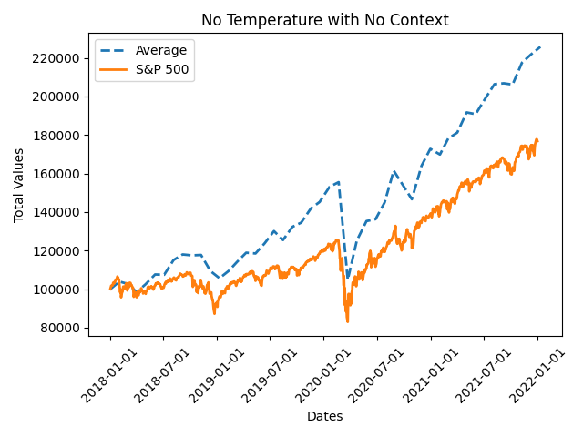

# Buffet Bot

LLMs for AI enhanced stock research and investing for the value investor.

## Usage

```bash
python main.py
```

## Findings
- LLMs without previous context deliver better stock picks. LLMs with no temperature sampling have less variance between simulations. See `output/experiments` for details.
- Claude outperforms index fund investing in a backtracked test run between 2018-01-01 to 2022-01-01. See `output/experiments/no_temp_no_context_4_year` for details.


## LLM behaviours

- We've tested a lack of reproducibility in the LLMs when prompted with stock picking options. This is due to inbuilt stochasticity in the models. We can adjust this with temperature parameter.
- Sometimes Anthropic's LLM returns % allocations greater than 100%.

## Resources
- [Design Doc (Internal)](https://docs.google.com/document/d/1ZFw9aQtlS4xDQt4nltQtCgG4GLMmYrOePZbgzkj242k/edit?usp=sharing)
- [Building a GPT-3 Enabled Research Assistant with LangChain & Pinecone](https://www.mlq.ai/gpt-3-enabled-research-assistant-langchain-pinecone/)
- [Can ChatGPT Forecast Stock Price Movements? Return Predictability and Large Language Models](https://papers.ssrn.com/sol3/papers.cfm?abstract_id=4412788)