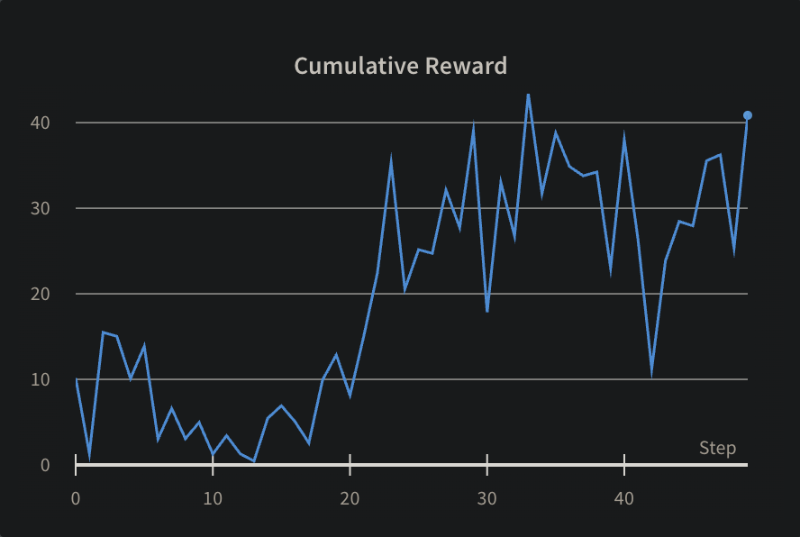

# GPT2 Shadow

Finetune a GPT2 model to produce outputs that will adversarially fool a GPT2 AI classifier. If this is achieved then we could have LLMs that are undetectable by other ML models.

This project has been awesome in building RL intuitions so it has served its purpose, archiving for now. To continue working on this, I'd need to invest more compute and money into buying data.

## Findings

I first used a largely supervised approach using a multitask approach combining a next token prediction loss with an AI classifier loss. The model managed to game the loss function to produce non-sensical outputs whilst reducing loss and loss wasn't propagating properly through autoregressive forward functions. See `train_supervised.py` for this approach.

Then I tried an RL actor critic approach using PPO optimization algorithm to train the model where the reward signal is provided by the AI classifier. See `train_rl.py` for this approach.

Reward is going up ([W&B](https://wandb.ai/michaelliangaus/llm_rl_finetuning/runs/qn5s35jp?workspace=user-michaelliangaus))



But the model is gaming the classifier. It's producing outputs that are non-sensical but are classified as human. Example of an output.

```
Hello, how are you? ( ( MTA OPEN ( Silent ( ( ( ( ( ( ( ( ( (Break ( ( ( ( ( ( ( ( monog ( ( ( Ignore ( ( ( ( ( ( ( ( ( Tr ( ( ( stoolENTSpret ( ( ( civilians']
```

To try fix this, I explored using an additional loss from the RL environment that is comparing cosine similarity between the sentence embeddings of the generated output and original prompt up to that token which should encourage the model to produce outputs that are similar in meaning to the prompt. However, I think a pretrained RLHF model might be a better solution so I prioritised this.

However, taking a pretrained GPT2RLHF model off huggingface doesn't seem to work so well and we get similar results. Model is hacking the reward function.
```
Decoded sequence: ["Explain nuclear fusion like I'm five.\n\n\n\n\n\n\n\n\n\n\n\n\n\n\n\n\n\n\n\n\n\n\n\n\n\n\n\n shelves\n\n\n\n\n\n\n\n\n\n\n\n\n\n\n\n\n\n\n\n\n\n\n\n\n\n\n\n\n\n cub"]
```

We can also try to build our own reward model to combine classifier and language model perplexity.

I'd like to train this on a model better than GPT2 because GPT2 outputs aren't that great. However the bottleneck is that there are no other better OS AI classifier models out there.

The only option to train these is to ping an API during training or create a dataset that we use to train our own classifier which'll cost money.

## Ideas
- Could we use an LLM to produce the RLHF rewards? I just need a proxy for perplexity.

## Resources
https://huggingface.co/sentence-transformers/all-MiniLM-L6-v2

https://huggingface.co/gpt2

https://huggingface.co/roberta-base-openai-detector

https://huggingface.co/OpenAssistant/reward-model-deberta-v3-large-v2

https://huggingface.co/sentence-transformers/all-MiniLM-L6-v2

https://huggingface.co/mistralai/Mistral-7B-Instruct-v0.1
https://huggingface.co/sugam11/gpt2-rlhf-reward